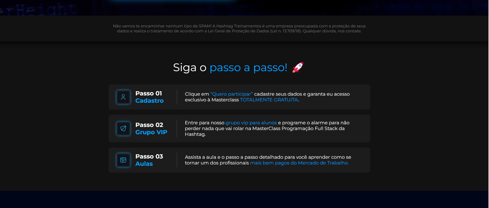
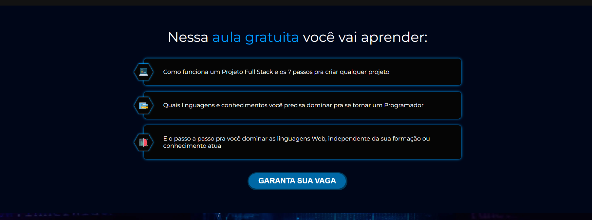

<h1 align="center"> Landing Page </h1>

 Página Principal
  

 Seção de Disclaimer
  

 Seção de Aprendizado
  

 Pop-up ao Pressionar o Botão
  

## 🚀 Tecnologias

Esse projeto foi desenvolvido com as seguintes tecnologias:

- HTML
- CSS
- JavaScript

## 💻 Projeto

Esse é um template de uma Landing Page desenvolvido durante a MasterClass FullStack da Hashtag. As Landing Pages tem sido muito requisitadas nos dias de hoje pelos coachs e demais pessoas que buscam vender algo na internet ou dar algum tipo de curso gratuito, sendo uma ótima opção pela sua versatilidade.
